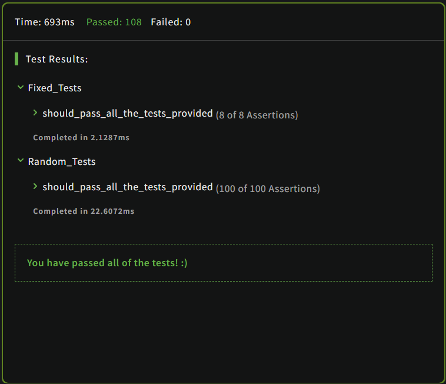

# Kata: Beginner Series #2 Clock  

#### [Link to kata](https://www.codewars.com/kata/55f9bca8ecaa9eac7100004a)  

## Question:  

### Clock shows `h` hours, `m` minutes and `s` seconds after midnight.  

### Your task is to write a function which returns the time since midnight in milliseconds.  

### **Example:**  

```
h = 0
m = 1
s = 1

result = 61000
```  

### Input constraints:  

- `0 <= h <= 23`  
- `0 <= m <= 59`  
- `0 <= s <= 59`  

### **Prototype:**  
```c
int past(int h, int m, int s);
```  
___  
### **Language: C**  
### **Level: 8kyu**  
### **Tags:** `fundamentals`  
### **Result:**  
  

#### Date: 12/01/2023  
