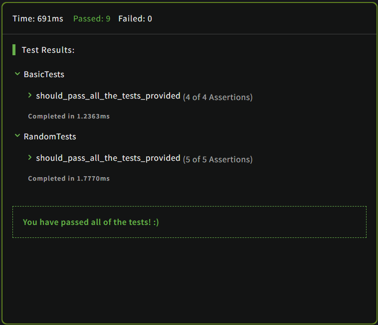

# Kata: Keep Hydrated!  
#### [Link to kata](https://www.codewars.com/kata/582cb0224e56e068d800003c)  
## Question:  

### Nathan loves cycling.  

### Because Nathan knows it is important to stay hydrated, he drinks 0.5 litres of water per hour of cycling.  

### You get given the time in hours and you need to return the number of litres Nathan will drink, rounded to the smallest value.  

### **For example:**  

```
time = 3 ----> litres = 1

time = 6.7---> litres = 3

time = 11.8--> litres = 5
```  

### **Prototype:**  
```c
int Liters(double time);
```  
___  
### **Language: C**  
### **Level: 8kyu**  
### **Tags:** `algorithms` `mathematics` `fundamentals`  
### **Result:**  
  

#### Date: 12/01/2023  


