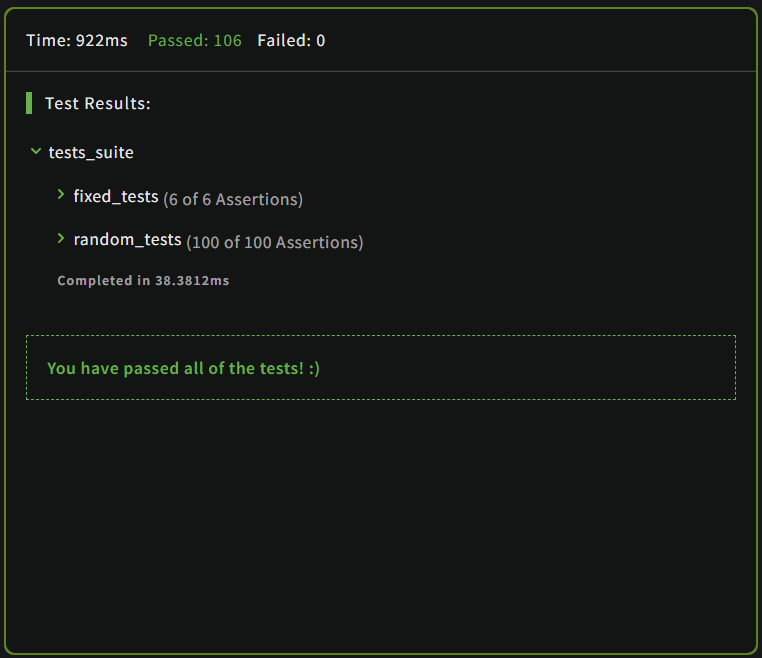

# Kata: Reversed words [link](https://www.codewars.com/kata/51c8991dee245d7ddf00000e)  
## Question:  
### Complete the solution so that it reverses all of the words within the string passed in.  

### Words are separated by exactly one space and there are no leading or trailing spaces.  

### **Example: Input -> Output**  
`"The greatest victory is that which requires no battle" --> "battle no requires which that is victory greatest The"`  
### **Language: C** 
### **Prototype:**  
```c 
char *reverse_words (const char *words, size_t length, char *reversed);
```  
### **Level: 8kyu**  
### **Tags:** `strings` `algorithms`  
### **Result:**  
  

#### Date: 11/01/2023  
